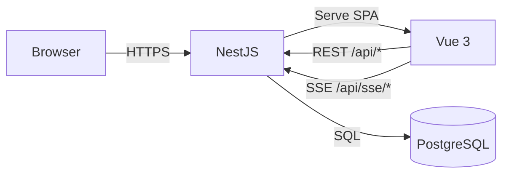
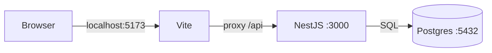
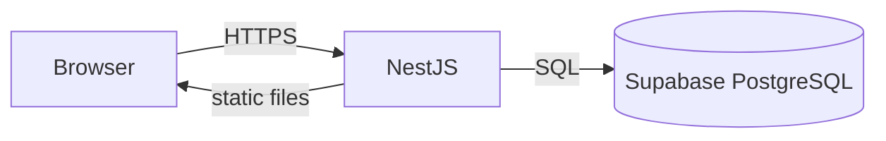
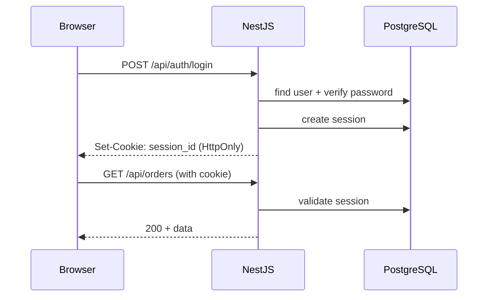
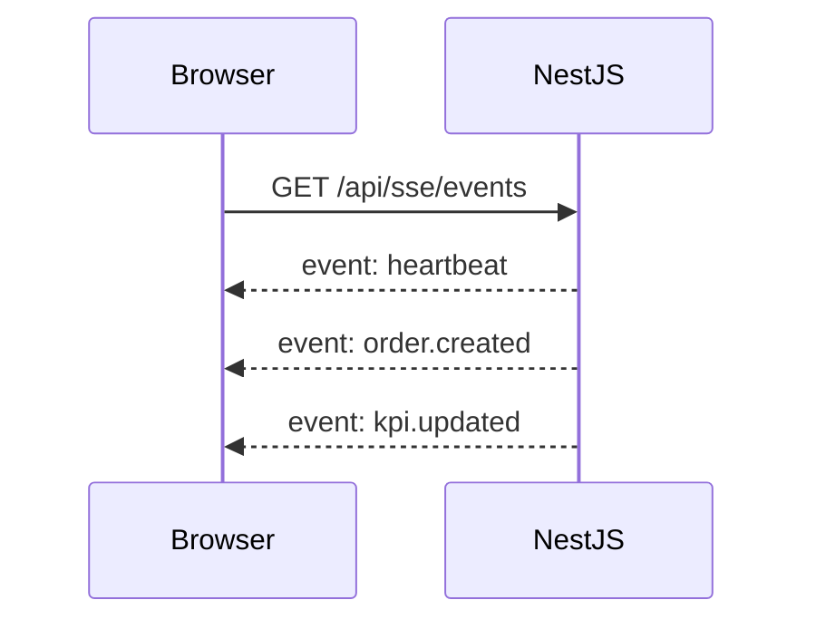

# Architecture — Shopify Analytics Dashboard

Dashboard analytics "Shopify-like" pour démo portfolio :

- **SPA** Vue 3 avec widgets, thème, layout personnalisable
- **API** NestJS avec auth, endpoints mock, persistance layout
- **Temps réel** via SSE
- **PostgreSQL** avec migrations et seed idempotent
- **Déploiement** single origin (backend sert le SPA)

## Decisions

| Subject  | Decision                   | Rationale                                         |
| -------- | -------------------------- | ------------------------------------------------- |
| Monorepo | pnpm workspaces            | Simple, shared types, unified scripts             |
| Backend  | NestJS 11                  | Modular, guards, Swagger, DI                      |
| Frontend | Vue 3 + Pinia + Router     | Modern SPA, simple state                          |
| UI       | PrimeVue                   | Fast components, theming                          |
| Charts   | ECharts (vue-echarts)      | Flexible, professional                            |
| Grid     | gridstack.js               | Mature drag/drop/resize                           |
| Auth     | Session cookies (HttpOnly) | Simple, secure, same-origin friendly              |
| Realtime | SSE                        | Unidirectional sufficient, simpler than WebSocket |
| Database | PostgreSQL 16              | Standard, Supabase-friendly                       |
| ORM      | Prisma v7                  | Migrations, types, driver adapter                 |
| Seed     | Idempotent (upsert)        | Safe to re-run in public sandbox                  |
| Deploy   | Backend serves SPA         | No CORS, cookies + SSE work seamlessly            |

See `docs/adr/` for detailed records.

## System Overview



Single origin: SPA + API + SSE share the same host.

## Environments

### Local (Development)



- Vite dev server on port 5173
- Proxy redirects `/api` to NestJS on port 3000
- PostgreSQL via Docker Compose

### Production



Single NestJS service serves:

- Static SPA files
- REST API
- SSE events

## Project Structure

```
shopify-dashboard/
├── apps/
│   ├── api/                      # NestJS backend
│   │   ├── prisma/
│   │   │   ├── schema.prisma
│   │   │   ├── migrations/
│   │   │   └── seed.ts
│   │   ├── src/
│   │   │   ├── auth/
│   │   │   ├── common/
│   │   │   ├── config/
│   │   │   ├── health/
│   │   │   ├── prisma/
│   │   │   └── main.ts
│   │   └── prisma.config.ts
│   │
│   └── web/                      # Vue 3 frontend
│       └── src/
│           ├── components/
│           ├── composables/
│           ├── router/
│           ├── services/
│           ├── stores/
│           └── views/
│
├── shared/
│   └── types/                    # Shared TypeScript types
│
└── docs/
```

## Prisma v7 Configuration

| Aspect        | Approach                                 |
| ------------- | ---------------------------------------- |
| Provider      | `prisma-client` (not `prisma-client-js`) |
| Connection    | Via adapter `@prisma/adapter-pg`         |
| Module format | `moduleFormat = "cjs"`                   |
| PrismaService | Composition pattern (not inheritance)    |

NestJS does not support ESM natively. Configured as CommonJS.

## Authentication

Session-based auth with HttpOnly cookies. No JWT.



### Endpoints

| Method | Path             | Description              |
| ------ | ---------------- | ------------------------ |
| POST   | /api/auth/demo   | Demo login (no password) |
| POST   | /api/auth/login  | Email/password login     |
| GET    | /api/auth/me     | Current user             |
| POST   | /api/auth/logout | Destroy session          |

## Realtime (SSE)

Server-Sent Events for unidirectional updates.



### Events

| Event         | Description             |
| ------------- | ----------------------- |
| order.created | New order (every 5-15s) |
| kpi.updated   | KPI refresh (every 30s) |
| stock.alert   | Low stock warning       |
| heartbeat     | Keep-alive (every 30s)  |

### Limits

- Max 5 SSE connections per IP
- Returns 204 if limit reached (prevents EventSource retry loop)

## Dashboard Layout

Persisted per user in `dashboard_layouts.config` (JSONB).

| Method | Path                  | Description                |
| ------ | --------------------- | -------------------------- |
| GET    | /api/dashboard/layout | Get user layout            |
| PUT    | /api/dashboard/layout | Save layout (rate limited) |

Frontend saves with 2s debounce.

## Export

| Method | Path              | Description                                |
| ------ | ----------------- | ------------------------------------------ |
| GET    | /api/export/:type | Download CSV (orders, products, customers) |

UTF-8 with BOM for Excel compatibility.

## Security

See `docs/security.md` for details.

| Measure        | Implementation                       |
| -------------- | ------------------------------------ |
| Cookies        | HttpOnly, Secure, SameSite=Lax       |
| Sessions       | 24h TTL + CRON cleanup               |
| Rate limiting  | 100 req/min/IP global                |
| Layout save    | 5 saves/min/session                  |
| SSE            | 5 connections/IP max                 |
| Validation     | class-validator on all inputs        |
| Error messages | Generic auth errors (no enumeration) |

## Observability

| Aspect  | Implementation               |
| ------- | ---------------------------- |
| Logging | nestjs-pino, structured JSON |
| Health  | GET /api/health              |
| Uptime  | External ping (UptimeRobot)  |

## Configuration

| Variable           | Description                  |
| ------------------ | ---------------------------- |
| DATABASE_URL       | PostgreSQL connection string |
| NODE_ENV           | development / production     |
| PORT               | Server port (default 3000)   |
| DEMO_EMAIL         | Demo account email           |
| JOHN_EMAIL         | Test user email              |
| JOHN_PASSWORD      | Test user password           |
| BCRYPT_SALT_ROUNDS | Hash rounds (default 10)     |

## References

- Data model: `docs/data-model.md`
- Security: `docs/security.md`
- ADRs: `docs/adr/`
- Spikes: `docs/spikes/`
