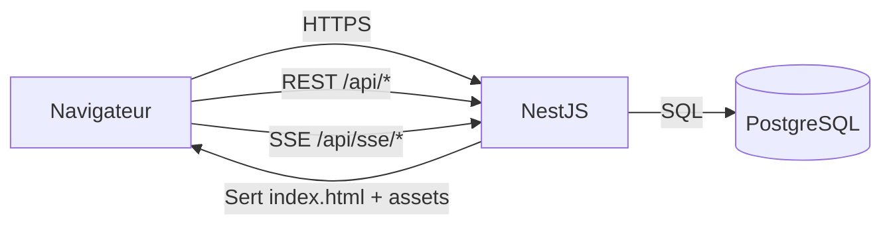
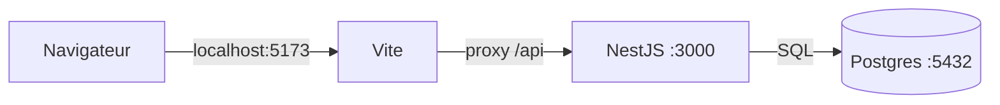

# Architecture — Shopify Analytics Dashboard

Dashboard analytics "Shopify-like" pour démo portfolio :

- **SPA** Vue 3 (Pinia + Router) avec widgets, thème et layout personnalisable
- **API** NestJS avec auth, endpoints mock et persistance du layout
- **Temps réel** via SSE
- **PostgreSQL** avec migrations et seed idempotent
- **Déploiement** single origin (le backend sert le SPA)

---

## Décisions

| Sujet       | Décision                           | Justification                                     |
| ----------- | ---------------------------------- | ------------------------------------------------- |
| Monorepo    | pnpm workspaces                    | Partage de types, scripts unifiés                 |
| Backend     | NestJS 11                          | Modulaire, guards, Swagger, injection dépendances |
| Frontend    | Vue 3 + Pinia + Router             | SPA moderne, état simple                          |
| UI          | PrimeVue 4 + thème Aura (PrimeUIX) | Composants rapides, thème, dark mode              |
| Graphiques  | ECharts (vue-echarts)              | Flexible, rendu professionnel                     |
| Grille      | gridstack.js                       | Drag/drop/resize mature                           |
| Auth        | Sessions via cookie HttpOnly       | Simple, sécurisé, compatible same-origin          |
| Temps réel  | SSE                                | Unidirectionnel suffit, plus simple que WebSocket |
| Database    | PostgreSQL 16                      | Standard, compatible Supabase                     |
| ORM         | Prisma v7                          | Migrations, typage, adapter PG                    |
| Seed        | Idempotent (upsert)                | Rejouable en sandbox publique                     |
| Déploiement | Backend sert le SPA                | Pas de CORS, cookies + SSE simplifiés             |

Voir `docs/adr/` pour les détails (notamment ADR-002 et ADR-004).

---

## Vue d'ensemble du système

### Production (single origin)



**Principe clé :** SPA + API + SSE partagent le **même origin**, ce qui supprime la complexité CORS et simplifie l'auth par cookie.

### Développement local



- Vite sur port 5173
- Proxy `/api` vers NestJS sur port 3000
- PostgreSQL via Docker Compose

---

## Diagramme des composants

```
┌─────────────────────────────────────────────────────────────────────────────┐
│                              NAVIGATEUR                                     │
│  ┌───────────────────────────────────────────────────────────────────────┐  │
│  │                         Vue 3 SPA                                     │  │
│  │  ┌─────────────┐  ┌─────────────┐  ┌─────────────┐  ┌─────────────┐   │  │
│  │  │   Router    │  │   Pinia     │  │  Composables│  │   Vues      │   │  │
│  │  │   Guards    │  │   Stores    │  │  useTheme   │  │  Login      │   │  │
│  │  │             │  │  - auth     │  │  useSSE     │  │  Dashboard  │   │  │
│  │  └─────────────┘  └─────────────┘  └─────────────┘  └─────────────┘   │  │
│  │                              │                                         │  │
│  │                    ┌─────────┴─────────┐                               │  │
│  │                    │    Client API     │                               │  │
│  │                    │  (axios + cookie) │                               │  │
│  │                    └─────────┬─────────┘                               │  │
│  └──────────────────────────────│────────────────────────────────────────┘  │
└─────────────────────────────────│───────────────────────────────────────────┘
                                  │ HTTPS (même origin)
                                  ▼
┌─────────────────────────────────────────────────────────────────────────────┐
│                           Backend NestJS                                    │
│  ┌─────────────────────────────────────────────────────────────────────┐   │
│  │                    ServeStaticModule                                 │   │
│  │                    (sert apps/web/dist)                              │   │
│  └─────────────────────────────────────────────────────────────────────┘   │
│                                                                             │
│  ┌──────────────┐  ┌──────────────┐  ┌──────────────┐  ┌──────────────┐   │
│  │  AuthModule  │  │ HealthModule │  │  MockModule  │  │  SSEModule   │   │
│  │              │  │              │  │              │  │              │   │
│  │ - login      │  │ - /health    │  │ - orders     │  │ - events     │   │
│  │ - logout     │  │              │  │ - products   │  │ - heartbeat  │   │
│  │ - me         │  │              │  │ - analytics  │  │              │   │
│  │ - demo       │  │              │  │ - layout     │  │              │   │
│  └──────┬───────┘  └──────────────┘  └──────────────┘  └──────────────┘   │
│         │                                                                   │
│  ┌──────┴───────┐  ┌──────────────┐  ┌──────────────┐                      │
│  │SessionService│  │ThrottlerMod  │  │ScheduleModule│                      │
│  │              │  │ 300/min glob │  │ CRON cleanup │                      │
│  │ - create     │  │ 10/min auth  │  │              │                      │
│  │ - validate   │  │              │  │              │                      │
│  │ - delete     │  │              │  │              │                      │
│  └──────┬───────┘  └──────────────┘  └──────────────┘                      │
│         │                                                                   │
│  ┌──────┴───────────────────────────────────────────────────────────────┐  │
│  │                         PrismaService                                 │  │
│  │                    (adapter: @prisma/adapter-pg)                      │  │
│  └──────────────────────────────────┬───────────────────────────────────┘  │
└─────────────────────────────────────│───────────────────────────────────────┘
                                      │ SQL
                                      ▼
                        ┌─────────────────────────┐
                        │     PostgreSQL 16       │
                        │  ┌───────────────────┐  │
                        │  │ users             │  │
                        │  │ sessions          │  │
                        │  │ dashboard_layouts │  │
                        │  └───────────────────┘  │
                        └─────────────────────────┘
```

---

## Flux principaux

### Flux 1 : Authentification (session cookie HttpOnly)

```
┌────────┐         ┌────────┐         ┌────────┐         ┌────────┐
│Navigat.│         │ NestJS │         │Sessions│         │  DB    │
└───┬────┘         └───┬────┘         └───┬────┘         └───┬────┘
    │                  │                  │                  │
    │ POST /api/auth/login               │                  │
    │ {email, password}│                  │                  │
    │─────────────────►│                  │                  │
    │                  │                  │                  │
    │                  │ recherche user par email           │
    │                  │─────────────────────────────────────►
    │                  │                  │                  │
    │                  │◄─────────────────────────────────────
    │                  │ user + mot de passe hashé          │
    │                  │                  │                  │
    │                  │ bcrypt.compare   │                  │
    │                  │                  │                  │
    │                  │ createSession    │                  │
    │                  │─────────────────►│                  │
    │                  │                  │ INSERT session   │
    │                  │                  │─────────────────►│
    │                  │                  │◄─────────────────│
    │                  │◄─────────────────│                  │
    │                  │ sessionId        │                  │
    │                  │                  │                  │
    │◄─────────────────│                  │                  │
    │ Set-Cookie: sessionId (HttpOnly)   │                  │
    │ {data: {id, email, role}}          │                  │
    │                  │                  │                  │
```

**Notes :**

- Pas de JWT : le cookie contient un **identifiant opaque** uniquement
- L'expiration est validée côté serveur à chaque requête
- Si expirée : suppression "lazy delete" et retour 401

### Flux 2 : Requête authentifiée

```
┌────────┐         ┌────────┐         ┌────────┐         ┌────────┐
│Navigat.│         │ NestJS │         │Sessions│         │  DB    │
└───┬────┘         └───┬────┘         └───┬────┘         └───┬────┘
    │                  │                  │                  │
    │ GET /api/orders  │                  │                  │
    │ Cookie: sessionId│                  │                  │
    │─────────────────►│                  │                  │
    │                  │                  │                  │
    │                  │ validateSession  │                  │
    │                  │─────────────────►│                  │
    │                  │                  │ SELECT session   │
    │                  │                  │─────────────────►│
    │                  │                  │◄─────────────────│
    │                  │                  │                  │
    │                  │                  │ vérif expiresAt  │
    │                  │                  │                  │
    │                  │◄─────────────────│                  │
    │                  │ user             │                  │
    │                  │                  │                  │
    │                  │ [Logique controller]               │
    │                  │                  │                  │
    │◄─────────────────│                  │                  │
    │ 200 {data: [...]}│                  │                  │
    │                  │                  │                  │
```

### Flux 3 : Routage SPA (deep links + refresh)

```
┌────────┐         ┌────────┐         ┌────────┐
│Navigat.│         │ NestJS │         │  Vue   │
└───┬────┘         └───┬────┘         └───┬────┘
    │                  │                  │
    │ GET /dashboard   │                  │
    │ (lien direct ou F5)                │
    │─────────────────►│                  │
    │                  │                  │
    │                  │ ServeStaticModule
    │                  │ (fallback SPA)   │
    │                  │                  │
    │◄─────────────────│                  │
    │ index.html       │                  │
    │                  │                  │
    │ GET /assets/index-xxx.js           │
    │─────────────────►│                  │
    │◄─────────────────│                  │
    │ (en cache immutable)               │
    │                  │                  │
    │ ─────────────────────────────────► │
    │                  │   Vue démarre    │
    │                  │   Router guard   │
    │                  │   checkAuth()    │
    │                  │                  │
    │ GET /api/auth/me │                  │
    │─────────────────►│                  │
    │◄─────────────────│                  │
    │ {data: user} ou 401                │
    │                  │                  │
    │ ◄───────────────────────────────── │
    │                  │  Affiche la vue  │
    │                  │  (Login ou Dashboard)
    │                  │                  │
```

**Pourquoi c'est important :** Sans fallback `index.html`, un refresh sur `/dashboard` casserait (404). Le backend sert `index.html`, puis Vue Router gère la route côté client.

### Flux 4 : SSE temps réel

```
┌────────┐         ┌────────┐         ┌────────┐
│Navigat.│         │ NestJS │         │Scheduler│
└───┬────┘         └───┬────┘         └───┬────┘
    │                  │                  │
    │ GET /api/sse/events                │
    │ Cookie: sessionId│                  │
    │─────────────────►│                  │
    │                  │                  │
    │ ◄──── Connexion SSE ouverte ────   │
    │                  │                  │
    │                  │◄─────────────────│
    │                  │ émet order.created
    │◄─────────────────│                  │
    │ event: order.created               │
    │ data: {order...} │                  │
    │                  │                  │
    │                  │◄─────────────────│
    │                  │ émet kpi.updated │
    │◄─────────────────│                  │
    │ event: kpi.updated                 │
    │ data: {kpis...}  │                  │
    │                  │                  │
    │                  │◄─────────────────│
    │                  │ émet heartbeat   │
    │◄─────────────────│                  │
    │ event: heartbeat │                  │
    │                  │                  │
```

---

## Structure du projet

```
shopify-dashboard/
├── apps/
│   ├── api/                      # Backend NestJS
│   │   ├── prisma/
│   │   │   ├── schema.prisma
│   │   │   ├── migrations/
│   │   │   └── seed.ts
│   │   ├── src/
│   │   │   ├── auth/             # Module auth
│   │   │   │   ├── auth.controller.ts
│   │   │   │   ├── auth.service.ts
│   │   │   │   ├── sessions.service.ts
│   │   │   │   └── session-cleanup.service.ts
│   │   │   ├── common/           # Filtres, guards
│   │   │   ├── config/           # Config Swagger
│   │   │   ├── health/           # Health check
│   │   │   ├── prisma/           # PrismaService
│   │   │   ├── generated/        # Client Prisma
│   │   │   ├── app.module.ts
│   │   │   └── main.ts
│   │   └── prisma.config.ts
│   │
│   └── web/                      # Frontend Vue 3
│       ├── index.html
│       └── src/
│           ├── api/              # Client Axios
│           ├── assets/           # Styles
│           ├── composables/      # useTheme
│           ├── router/           # Vue Router + guards
│           ├── stores/           # Pinia (auth)
│           └── views/            # Login, Dashboard
│
├── shared/
│   └── types/                    # Types TypeScript partagés
│
└── docs/
    ├── architecture.md           # Ce fichier
    ├── api.md                    # Référence API
    ├── security.md               # Documentation sécurité
    ├── data-model.md             # Schéma base de données
    └── adr/                      # Architecture Decision Records
```

---

## Configuration Prisma v7

| Aspect        | Approche                                   |
| ------------- | ------------------------------------------ |
| Provider      | `prisma-client` (pas `prisma-client-js`)   |
| Connexion     | Via adapter `@prisma/adapter-pg`           |
| Format module | `moduleFormat = "cjs"` (compatible NestJS) |
| PrismaService | Pattern composition (`prisma.client`)      |

---

## Authentification

Auth basée sur sessions avec cookies HttpOnly. Pas de JWT. Voir [ADR-002](adr/002-session-id-sans-jwt.md).

### Endpoints

| Méthode | Chemin           | Auth      | Rate Limit  | Description                |
| ------- | ---------------- | --------- | ----------- | -------------------------- |
| POST    | /api/auth/demo   | Aucune    | 10 req/min  | Login démo (sans password) |
| POST    | /api/auth/login  | Aucune    | 10 req/min  | Login email/password       |
| GET     | /api/auth/me     | Requise   | 300 req/min | Utilisateur courant        |
| POST    | /api/auth/logout | Optionnel | 300 req/min | Détruit la session         |

### Attributs du cookie

| Attribut | Valeur              |
| -------- | ------------------- |
| Nom      | `sessionId`         |
| HttpOnly | `true`              |
| Secure   | `true` (production) |
| SameSite | `Lax`               |
| Path     | `/`                 |
| Expires  | 24 heures           |

Documentation complète : `docs/api.md`

---

## Temps réel (SSE)

Server-Sent Events pour les mises à jour unidirectionnelles.

### Événements

| Événement     | Intervalle   | Description           |
| ------------- | ------------ | --------------------- |
| order.created | 5-15s        | Nouvelle commande     |
| kpi.updated   | 30s          | Rafraîchissement KPIs |
| stock.alert   | 45-90s (30%) | Alerte stock bas      |
| heartbeat     | 30s          | Keep-alive            |

### Limites

- Maximum 5 connexions SSE par IP
- Retourne 204 si limite atteinte (évite la boucle de retry EventSource)

---

## Service des fichiers statiques

Voir [ADR-004](adr/004-backend-sert-frontend.md).

### Headers de cache

| Type de fichier | Cache-Control                         |
| --------------- | ------------------------------------- |
| `index.html`    | `no-cache`                            |
| `/assets/*`     | `public, max-age=31536000, immutable` |
| Autres          | `public, max-age=3600`                |

### Fallback SPA

Toutes les routes non-API retournent `index.html`. Vue Router gère le routing côté client.

---

## Sécurité

Voir `docs/security.md` pour les détails.

| Mesure          | Implémentation                          |
| --------------- | --------------------------------------- |
| Cookies         | HttpOnly, Secure, SameSite=Lax          |
| Sessions        | TTL 24h, lazy delete, CRON cleanup      |
| Rate limiting   | 300 req/min/IP global                   |
| Endpoints auth  | 10 req/min/IP                           |
| Trust proxy     | Configurable via `TRUST_PROXY_HOPS`     |
| Validation      | class-validator + ValidationPipe        |
| Messages erreur | Génériques sur login (anti-énumération) |

---

## Observabilité

| Aspect | Implémentation              |
| ------ | --------------------------- |
| Logs   | nestjs-pino, JSON structuré |
| Health | GET /api/health             |
| Uptime | Ping externe (UptimeRobot)  |

---

## Configuration

| Variable         | Description                 | Défaut      |
| ---------------- | --------------------------- | ----------- |
| DATABASE_URL     | Chaîne connexion PostgreSQL | (requis)    |
| NODE_ENV         | development / production    | development |
| PORT             | Port du serveur             | 3000        |
| TRUST_PROXY_HOPS | Nombre de proxies inverses  | 0           |

---

## Build et déploiement

### Scripts

```bash
pnpm build        # Build web, puis api
pnpm start        # Démarre le serveur production
pnpm dev          # Démarre les deux en mode dev
```

### Ordre de build

1. `pnpm build:web` — Vite génère `apps/web/dist`
2. `pnpm build:api` — NestJS compile vers `apps/api/dist`

L'ordre est important : ServeStaticModule a besoin que `apps/web/dist` existe.

### Démarrage production

```bash
node apps/api/dist/main.js
```

Un seul processus sert SPA + API + SSE.

---

## Références

- Modèle de données : `docs/data-model.md`
- Référence API : `docs/api.md`
- Sécurité : `docs/security.md`
- ADRs : `docs/adr/`
- Spikes : `docs/spikes/`

```

```
